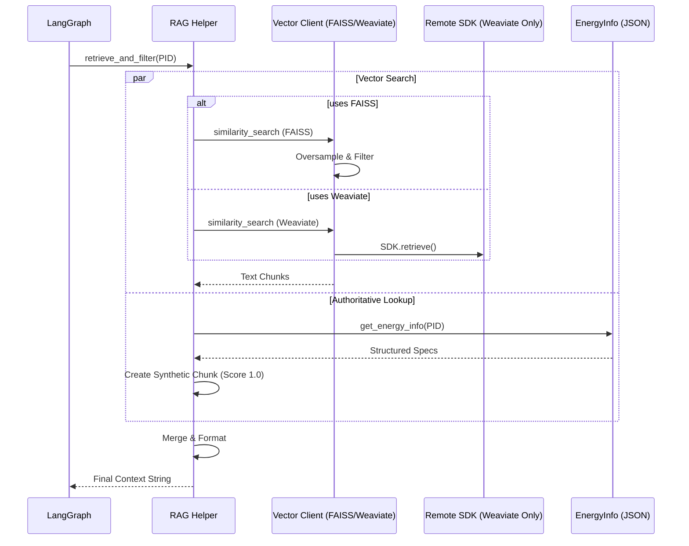
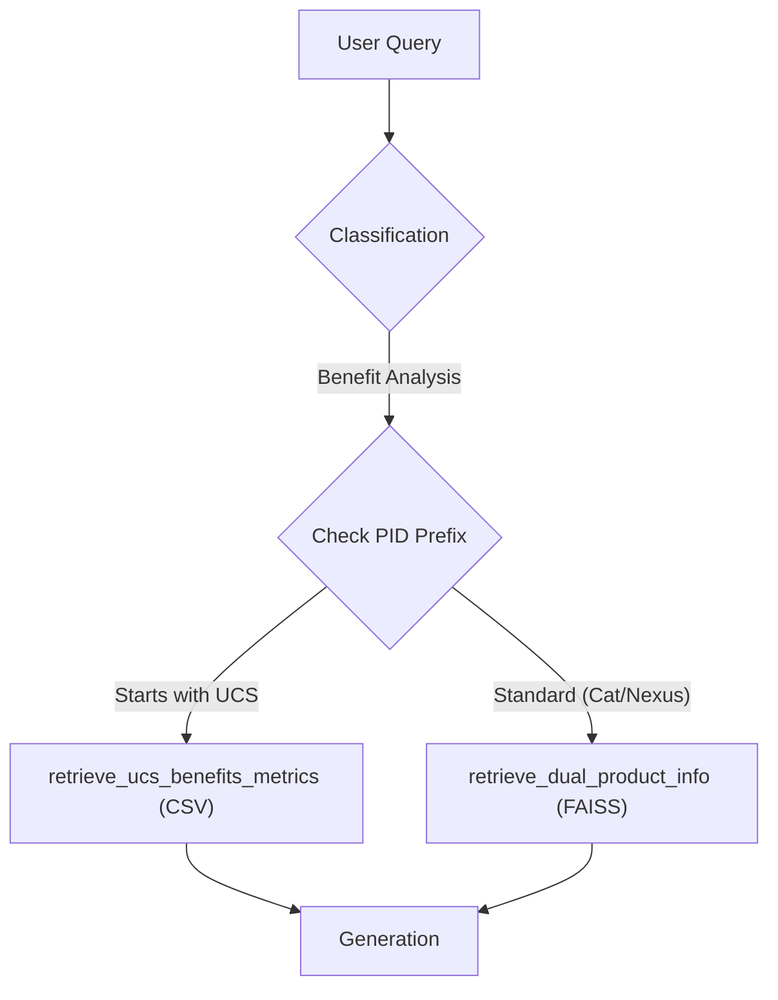

# RAG Retrieval Architecture

## Information Sources
- **Files Analyzed**: 
  - `api/src/openapi_server/utils/rag_files/rag_helper.py`
  - `api/src/openapi_server/utils/rag_files/faiss_client.py`
  - `api/src/openapi_server/utils/rag_files/weaviate_client.py`
  - `api/src/openapi_server/main.py`
  - `api/src/openapi_server/impl/ai_agent_api_impl.py`
  - `api/src/openapi_server/utils/energy_info.py`

## Executive Overview
The retrieval subsystem supports a **Dual-Mode Architecture**, allowing dynamic switching between two vector store implementations (FAISS and Weaviate).

- **FAISS**:
  - **Mechanism**: Relies on a **Hybrid Static-Index / Dynamic-Filter** approach. It loads pre-computed embeddings into memory to work offline.
  - **Key Pattern**: **Oversampling with Post-Filtering** (fetch `k*15` candidates, filter by metadata in Python).
  
- **Weaviate**:
  - **Mechanism**: Delegates retrieval to an external enterprise service via the `ai_framework_sdk`.
  - **Key Pattern**: **Server-Side Retrieval** (offloads embedding generation and vector search to the remote cluster).

## Architecture Summary
| Component | Implementation | Responsibility |
| :--- | :--- | :--- |
| **Logic Layer** | `rag_helper.py` | Orchestrates queries, templates, energy data injection, and CSV lookups. |
| **Vector Store (FAISS)** | `faiss_client.py` | Manages the in-memory FAISS index with pre-computed vectors. |
| **Vector Store (Weaviate)** | `weaviate_client.py` | Connects to the Weaviate instance via `ai_framework_sdk`. |
| **Embedding Strategy** | **Hybrid** | FAISS: Pre-computed `.npy` files. Weaviate: Server-side embedding models. |
| **Persistence** | **Hybrid** | FAISS: `embeddings.npy`, `texts.pkl`. Weaviate: Remote Database. |
| **Structured Data** | Pandas/JSON | `energy_info.py` and CSVs are used for non-vector data (UCS benefits, power specs). |

## Retrieval Workflow

### 1. Decision Logic (Vector Store Selection)
The system decides which vector store to use based on the `VECTOR_STORE_TYPE` environment variable. This decision propagates through three layers:
1.  **Startup**: `main.py` checks `os.getenv("VECTOR_STORE_TYPE")`. If it is NOT "faiss", it initializes the `WeaviateClient`.
2.  **Request**: `ai_agent_api_impl.py` captures the type in the request workflow state.
3.  **Execution**: `rag_helper.py` reads the type from the state to dispatch calls to the appropriate client (`FaissClient` vs `WeaviateClient`).

### 2. The Retrieval Pipeline (`rag_helper.py`)
This layer sits between the LangGraph workflow and the persistence layer. It handles the "business logic" of retrieval.

**Key Logic:**
-   **Query Templating**: Converts simple PIDs into semantic queries (e.g., `"{pid} specifications features capabilities..."`).
-   **Dual Retrieval**: For comparisons, it triggers two distinct retrieval operations (one for Source, one for Target).
-   **Authoritative Injection**: checks `EnergyInfo` (a separate utility). If data exists, it creates a synthetic "Chunk" with `score=1.0` and a warning to the LLM to ignore other sources.
-   **UCS Specialization**: If the router detects a UCS product, it bypasses the vector store entirely for "Benefit Analysis" and reads directly from `UCS_BENEFITS` (CSV).

### 3. The Vector Interface (FAISS: `faiss_client.py`)
The `FaissClient` implements a Singleton pattern to hold the index in memory.

**Key Logic:**
-   **Initialization**: Loads `texts.pkl` (content), `metadata.pkl` (attributes), and `embeddings.npy` (vectors).
-   **Fake Embeddings**: Since vectors are already computed, the client uses `langchain.embeddings.FakeEmbeddings` to satisfy the FAISS interface without requiring an actual model (like OpenAI/HuggingFace) in memory.
-   **Semantic Search**:
    ```python
    # 1. Oversample (Fetch 16 * 15 = 240 candidates)
    raw_results = vector_store.similarity_search_with_score(query, k=k * 15)

    # 2. Strict Filtering (Python Code)
    # Checks if 'doc_summary' metadata contains the specific Product ID
    ```

### 4. The Vector Interface (Weaviate: `weaviate_client.py`)
The `WeaviateClient` acts as a connector to an external `ai_framework_sdk`. It does *not* manage embeddings or indices locally.

**Key Logic:**
-   **Delegation**: The class imports `ai_framework_sdk` and delegates retrieval operations.
-   **Real Embeddings**: Unlike the local FAISS "FakeEmbeddings" trick, this path assumes the remote service generates real embeddings for the query string.
-   **Semantic Search**:
    ```python
    # 1. Build Query Object
    query_obj = RetrievalQuery(
        query=query,            # Raw text query
        top_k=k,                # Exact k (No oversampling needed)
        collection_name=...     # Target collection
    )
    
    # 2. Execute via SDK
    results = vector_store.retrieve(query_obj)
    ```

## Function Catalog

### `rag_helper.py`
| Function | Role | Logic |
| :--- | :--- | :--- |
| `retrieve_and_filter_product_info` | **Main Entry** | Templates query -> Calls Vector Store -> Injects Energy Info -> Returns Chunks. |
| `retrieve_dual_product_info` | **Orchestrator** | Calls `retrieve_and_filter_product_info` twice (Source/Target). |
| `retrieve_ucs_benefits_metrics` | **Data Access** | Reads `UCS_BENEFITS` CSV file directly (No Vector Search). |
| `format_chunks_for_llm` | **Formatter** | Truncates text to `max_total_chars` (30k) to prevent context overflow. |
| `route_after_classification` | **Router** | Decides path based on `query_type` + `source_pid` (e.g., "UCS" prefix). |

### `faiss_client.py`
| Function | Role | Logic |
| :--- | :--- | :--- |
| `init_faiss_vector_store` | **Startup** | Loads raw files and builds the in-memory index. |
| `similarity_search_with_score` | **Core Search** | Performs the Oversample -> Filter -> Sort pipeline. |

### `weaviate_client.py`
| Function | Role | Logic |
| :--- | :--- | :--- |
| `init_weaviate_vector_store` | **Startup** | Initializes `AIFrameworkSdk` and connects to the remote cluster. |
| `similarity_search_with_score` | **Core Search** | Wraps the SDK's `retrieve` method. Returns standard `Document` objects. |
| `upload_document` | **Ingestion** | Specific utility to upload PDF/Text content to the remote Weaviate collection. |

## Data Structures

### The "Chunk"
The system standardizes distinct data sources into a common dictionary format before passing to the LLM:

```python
{
    "text": "...",           # The content (from PDF or Authenticated Energy Source)
    "doc_id": "...",         # Source filename or "AUTHORITATIVE_SPECS_{pid}"
    "chunk_id": 0,           # Integer index
    "score": 0.85            # Similarity score or 1.0 for injected data
}
```

## Mermaid Diagrams

### 1. Retrieval Sequence (Dual Path)



### 2. UCS vs Standard Routing



## Risks & Recommendations

### 1. [FAISS] PID Filtering Fragility
The `faiss_client` relies on parsing `"Product IDs: C9300, ..."` from the `doc_summary` metadata field.
-   **Risk**: If the ingestion pipeline formats this string differently (e.g., case sensitivity, spacing), the filter will silently drop relevant documents.
-   **Rec**: Move Product IDs to a dedicated list/array field in metadata during ingestion, rather than parsing a string at runtime.

### 2. [FAISS] Memory Usage
The system loads `embeddings.npy` entirely into RAM.
-   **Risk**: As the document set grows, application memory usage will scale linearly with the vector count.
-   **Rec**: For larger scales, switch to a remote vector store (Weaviate/Qdrant) or use memory-mapped indices in FAISS on disk.

### 3. [FAISS] Oversampling Efficiency
Fetching `k*15` documents for every query is computationally expensive if the index grows large.
-   **Risk**: Latency increases.
-   **Rec**: Utilize FAISS pre-filtering (if available via dedicated metadata filters) rather than post-filtering in Python.

### 4. [General] Authoritative Data Override
The system injects Energy Info with a prompt wrapper saying "IGNORE ALL OTHER SPECIFICATIONS".
-   **Strength**: Excellent for preventing hallucination on numeric specs.
-   **Risk**: If `energy_info.json` is outdated, the model is forced to be wrong even if the retrieved PDF is newer. Update processes for this JSON are critical.

### 5. [Weaviate] External Dependency
The Weaviate path relies on `ai_framework_sdk`, which is an external library.
-   **Risk**: If the SDK changes its API or the remote Weaviate cluster is unreachable, the RAG pipeline fails completely.
-   **Rec**: Implement a fallback mechanism to Local FAISS if the remote Weaviate connection fails during startup.

## References
- https://docs.langchain.com/oss/python/integrations/vectorstores/faiss
- https://reference.langchain.com/v0.3/python/core/embeddings/langchain_core.embeddings.fake.FakeEmbeddings.html
- https://reference.langchain.com/v0.3/python/community/vectorstores/langchain_community.vectorstores.faiss.FAISS.html
